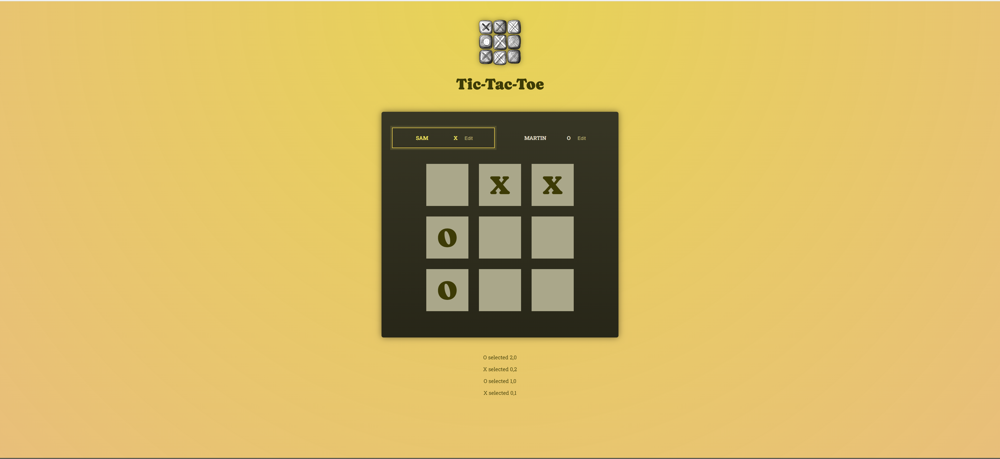

# tic_tac_toe
Welcome to the Tic-Tac-Toe game! This project is a classic implementation of the Tic-Tac-Toe game using React, JSX, JavaScript, HTML, and CSS.

## Features
- **React Functional Components**: The game leverages the power of React to create a dynamic and responsive user interface.
- **State Management with useState Hook**: Utilized React useState Hook for efficient state management.
- **Interactive UI**: Provides an interactive user interface where players can take turns to play the game.

## Installation 
To run this app locally, clone the repository
- Install dependencies using the command:  ```npm install```
- Run the dev server using: ```npm run dev```

## Demo


**Click to view the app :** [Live Demo](https://tic-tac-toe-nkk.netlify.app/)

## Code Structure
### Components:
- App.jsx: The main component that sets up the game.
- GameBoard.jsx: Manages the gameboard and cells.
- Players.jsx: Manages the players information such as player name, symbol and active player indication.
- Log.jsx: Displays the log of the moves made during the game.
- Gameover.jsx: Displays the game over screen and an option to rematch.

### State Management:
- Uses useState to manage the state of the game board, current player and to check for game-winning conditions after each move.


## Technologies used
- React 18.3.1
- JSX (JavaScript XML or JavaScript Extension)
- JS
- HTML
- CSS

## Acknowledgements
- Inspired by the classic Tic-Tac-Toe game that has entertained generations.
- Special thanks to **Maximilian Schwarzmüller** for their helpful tutorial (**React - The Complete Guide 2024**) that guided the implementation of this project.
